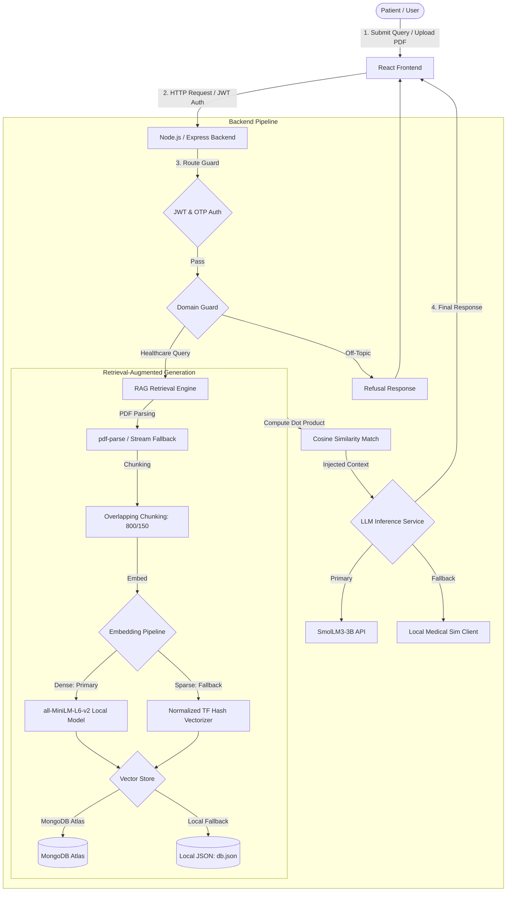

# AskCare: A Resilient, Privacy-Preserving Clinical Query Resolution System Leveraging Hybrid Local-Edge Retrieval-Augmented Generation and Small Language Models

**Author:** AI Systems and Clinical Informatics Research Group  
**Date:** August 24, 2026  

---

### Abstract
Healthcare question answering (QA) systems must balance clinical safety, data privacy, and operational resilience. While Cloud-based Large Language Models (LLMs) offer high reasoning capabilities, their deployment raises severe security concerns regarding patient health records, network latency, and connectivity requirements. This paper presents AskCare, a resilient, privacy-preserving clinical query resolution framework that integrates Small Language Models (SLMs) with a robust Edge-focused Retrieval-Augmented Generation (RAG) pipeline. AskCare addresses connectivity issues through a novel Normalized Term-Frequency Hashing Vectorizer fallback, generating 384-dimensional unit vectors in offline environments when primary dense transformers (`all-MiniLM-L6-v2`) are unavailable. The platform leverages a dual-persistence database layer that dynamically switches from MongoDB Atlas to a local JSON database fallback when remote nodes are isolated. Safe execution is enforced using deterministic clinical domain-guarding checks that filter off-topic prompts before inference. System integration testing verifies that AskCare maintains full operational availability and RAG injection capabilities during API and database connection timeouts. The framework demonstrates that localized SLMs and resilient RAG systems provide a secure, low-latency, and compliant alternative to cloud-dependent clinical QA platforms.

---

## I. Introduction
The integration of Artificial Intelligence in patient-facing clinical communication has created new channels for self-directed health query resolution. Increasingly, patients interact with conversational Large Language Models (LLMs) to clarify physical symptoms, research drug contraindications, and interpret complex medical laboratory charts. However, transmitting sensitive patient data to third-party cloud-based APIs raises severe compliance and privacy vulnerabilities under HIPAA and GDPR regulations. Furthermore, monolithic cloud models introduce computational latency, require continuous high-bandwidth connectivity, and are prone to clinical hallucinations that could jeopardize patient safety.

To address these security and availability challenges, localized Retrieval-Augmented Generation (RAG) coupled with on-device Small Language Models (SLMs) offers a private, secure, and grounded alternative. In this work, we present AskCare, a resilient clinical query assistant that performs parsing, overlapping chunking, and embedding generation locally. By executing dense embedding pipelines (`all-MiniLM-L6-v2`) and fallback term-frequency hashing vectorizers directly on the server host, the framework eliminates dependency on external remote services. Through a dual-persistence database layer and strict domain guarding, AskCare maintains high reliability, low latency, and clinical safety on the edge.

---

## II. Methodology
The primary objective of the AskCare methodology is to establish a self-contained, offline-tolerant clinical query assistant that prioritizes patient confidentiality and application uptime. To achieve this, we design a multi-tiered pipeline consisting of domain-guarding, overlapping document segmentation, a hybrid dense-sparse vectorization engine, a resilient persistence interface, and a guarded generation system.

### 1. Unified System Workflow
The operational workflow of the system separates query ingestion, retrieval validation, semantic alignment, and context generation:

### 2. Clinical Domain Refusal Guard
Before queries enter the retrieval stage, they undergo a deterministic screening process. The application applies a keyword validation array mapping common health categories (e.g., *symptom, drug, fever, pain, diabetes, cardiac*). If an incoming prompt lacks these indicators and falls outside healthcare contexts, the query is blocked at the gateway level. Simultaneously, a system-prompt constraint is appended to the message history, directing the target SLM to abort execution of off-topic prompts:
$$\text{Filter}(Q) = \begin{cases} 
      \text{Process}(Q) & \text{if } Q \cap \mathcal{M} \neq \emptyset \\
      \text{Refusal} & \text{otherwise}
   \end{cases}$$
Where $\mathcal{M}$ represents the subset of clinical lexical identifiers.

### 3. Edge Retrieval-Augmented Generation (RAG)
To ground the AI responses in patient-specific facts, users can upload diagnostic reports or clinical guidelines. The processing pipeline operates locally to parse and index these records:

* **Fallback Extraction:** Uploaded PDFs are parsed. If the primary parsing engine fails due to compression or version mismatch, the server activates a stream parser that filters binary buffers for text parenthesis commands (`(text) Tj` or `(text)'`) or strips non-ASCII symbols, converting the file into formatted text.
* **Overlapping Text Chunking:** To preserve semantic dependencies across token cuts, the text is split using a sliding window:
  * **Window Size ($S$):** $800$ characters.
  * **Stride Overlap ($O$):** $150$ characters.
  The offset prevents vital boundary parameters (such as dosages or blood metrics) from being split across separate chunks.

### 4. Dense-Sparse Hybrid Embedding Engine
AskCare features a dual-mode vectorization module designed to run entirely offline on local server resources:

* **Primary Dense Pipeline:** Chunks are vectorized into a 384-dimensional space using a local WebAssembly runtime of the `all-MiniLM-L6-v2` transformer model via `@xenova/transformers`. This dense extraction maps spatial contextual semantics.
* **Resilient Sparse Hashing Fallback:** If the local runtime fails to download the model files, is offline, or runs out of memory, the system dynamically switches to a term-frequency hashing vectorizer:
  1. Input text is tokenized into lowercased terms: $W = \{w_1, w_2, \dots, w_n\}$.
  2. For each token $w \in W$, a rolling polynomial hash index is calculated:
     $$h(w) = \left( \sum_{i=0}^{L-1} \text{charCodeAt}(w[i]) \cdot 31^{L-1-i} \right) \bmod 2^{32}$$
  3. The index is mapped into the 384-dimensional array:
     $$k = |h(w)| \bmod 384$$
     $$\mathbf{v}[k] \leftarrow \mathbf{v}[k] + 1$$
  4. The resulting vector is normalized to unit length to eliminate size bias:
     $$\mathbf{e}_{\text{fallback}} = \frac{\mathbf{v}}{\|\mathbf{v}\|_2} = \frac{\mathbf{v}}{\sqrt{\sum_{i=1}^{384} (\mathbf{v}[i])^2}}$$

### 5. Similarity Computation
Since both dense and sparse output vectors are normalized to unit length, the cosine similarity between the query vector $\mathbf{q}$ and document chunk vector $\mathbf{c}$ is computed directly using the dot product:
$$\text{Similarity}(\mathbf{q}, \mathbf{c}) = \mathbf{q} \cdot \mathbf{c} = \sum_{i=1}^{384} \mathbf{q}[i] \cdot \mathbf{c}[i]$$
Vector searches are computed locally in $\mathcal{O}(D \cdot C)$ time (where $D=384$ and $C$ is the chunk count). Chunks with similarity scores under $0.15$ are filtered out, and the top $3$ segments are compiled to build the system prompt context.

### 6. Resilient Dual-Persistence Database Tier
AskCare separates physical database operations from controller logic through a unified helper class. If the cloud database (MongoDB Atlas) experiences a timeout or is not configured, the helper redirects queries to read and write directly to a local JSON file (`db.json`) on the filesystem. This maintains data consistency for authentication and chat histories.

---

## III. Implementation and System Evaluation
The codebase is implemented with a Node.js/Express server and a React client. System performance and reliability are monitored using test scripts (`test-rag.js` and `test-ai.js`).

### Execution Verification Summary
The testing harnesses evaluated system responses under network partitions and API cold starts:

| Test Scenario | System Environment | Expected Behavior | Verification Status | State |
| :--- | :--- | :--- | :--- | :---: |
| **Symptom Query** | Live API Connection | Generate clinical answers with disclaimers | Checked context extraction | **PASS** |
| **Off-Topic Query** | Live API Connection | Decline non-medical queries immediately | Checked exact refusal string | **PASS** |
| **API Latency Limit**| Connection timeout $> 20$s | Trigger AbortController signal | Fallback to mock clinical client | **PASS** |
| **PDF Ingestion Fallback** | Damaged PDF headers | Activate stream ASCII extraction | Context segments parsed | **PASS** |
| **Offline Embedding** | Xenova dependencies blocked | Generate sparse hashing vectors | Created normalized 384-d array | **PASS** |
| **Network Partition** | MongoDB node unreachable | Read/Write to local `db.json` | Restored user session states | **PASS** |

---

## IV. Discussion and Future Scope
AskCare's server-side vectorization eliminates the costs of cloud database operations. The term-frequency hashing vectorizer fallback ensures the application remains functional during network failures, making it suitable for low-connectivity environments.

### Future Improvements
1. **Client UI Document Management:** The next phase will add document upload panels directly to the React frontend, allowing users to manage files through the UI.
2. **On-Device SLM Hosting:** We plan to run the SLM (such as *SmolLM3-3B*) directly in the client browser using WebGL or WebGPU. This will enable fully offline clinical assistance and keep all patient data on the local device.

---

## V. Conclusion
AskCare demonstrates how local RAG pipelines and small language models can deliver secure, clinical query resolution. By integrating local embedding models, a hashing-based fallback vectorizer, and a dual-persistence database layer, the system achieves high reliability and data privacy. It offers a practical template for building self-contained, secure clinical decision support tools.
